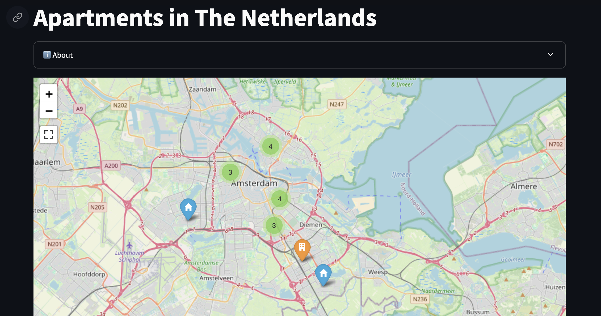

# Map of Apartments for rent in The Netherlands

A Streamlit app that displays a map that shows apartments that are for rent in some cities in The Netherlands and their distance
to their respective city center and to the ING offices in Amsterdam.

The data used for the apartments can be scraped from websites like [Pararius](https://www.pararius.com/apartments/amsterdam) using <https://github.com/Josersanvil/apartments-scraper>.



## Setup

### Setup with Docker

The easiest way to run the app is using Docker. This requires a [Docker Engine](https://docs.docker.com/engine/) installation.

You can pull the image from Docker Hub and run it with the following commands:

```bash
docker pull josersanvil/apartments-scraper-web-map:latest
docker run -p 8501:8501 --env-file=.env josersanvil/apartments-scraper-web-map:latest
```

This will spin up the streamlit app at <http://localhost:8501>.

> Remember to set the required environment variables in a `.env` file. See the [Environment variables](#environment-variables) section for more information.

### Build from source

You can also build the image from source. To do so, clone the repository and run the following commands:

```bash
docker build -t apartments-scraper-web-map .
docker run -p 8501:8501 --env-file=.env apartments-scraper-web-map
```

Or install the dependencies and run the app directly with streamlit. This requires Python 3.9+ and pip.

You can install the dependencies and run the app with the following commands:

```bash
pip install -r requirements.txt
cd app
streamlit run web/app.py
```

### Environment variables

You can set the following environment variables to configure the application. Some of them are required.

| Variable name | Description | Required | Default value |
| --- | --- | --- | --- |
| `APARTMENTS_DATASET_URI` | URI of the apartments dataset. Can be a local file or an S3 URI. | Yes | |
| `APARTMENTS_DATASET_FORMAT` | Format of the apartments dataset. Can be `csv` or `parquet`. | No | `parquet` |
| `APARTMENTS_WEB_HOSTNAME` | Hostname of the apartments website. | No | `http://localhost:8501` |
| `APARTMENTS_MAX_ENTRIES` | Maximum number of apartment entries to show in the map. | No | `500` |
| `APARTMENTS_MAP_OFFICE_NAME` | Name of the office to show in the app. | No | `the Office` |
